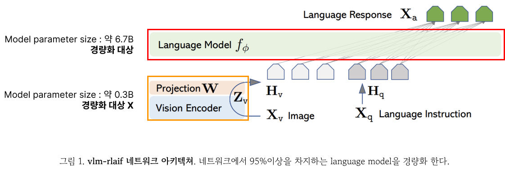
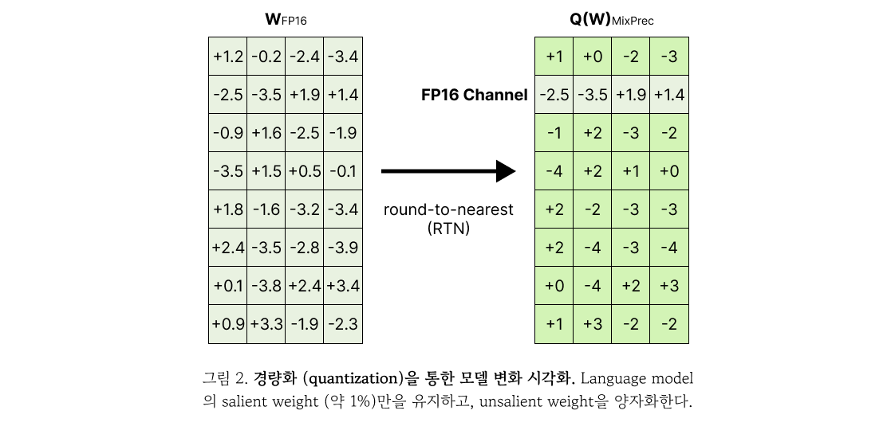

# vlm_rlaif_AWQ

<!-- This repo contains light weighted [vlm-rlaif](https://dcahn12.github.io/projects/vlm-rlaif/).
 -->
본 문서는 [vlm-rlaif](https://dcahn12.github.io/projects/vlm-rlaif/)모델과 AWQ를 적용하여 기존 모델을 경량화하는 소스코드의 실행 방법을 포함한다.

## Overview
<!-- 
</img> -->


* VLM-RLAIF 모델 아키텍쳐는 1) laguage model과 2) Vision encoer + Projection laayer로 구성되어있다. 본 연구진은 전체 모델의 약 95%에 해당하는 laguage model을 AWQ를 적용해 경량화 한다.

<!-- 
</img> -->


* 경량화 전 후 모델 변경 시각화. 좌측의 경량화 전의 모델은 FP16의 precision을 가진다. 전체 모델 중 약 1%의 salient weight은 그대로 유지하고 unsalient weight을 가장 가까운 정수로 반올림 (RTN)하여 모델의 parameter를 양자화한다.


## Install

0. Using Docker Container (Recommended)
```
docker pull hyeonbeomchoi/vlm_rlaif_awq
docker run --gpus all -it -v /PATH/TO/CODE:/PATH/TO/CODE --name=CONTAINER_NAME hyeonbeomchoi/vlm_rlaif_awq bash
```

## Usage

1. Prepare Original Weights and VCG-bench for vlm_rlaif_video_llava_7b
```
cd vlm-rlaif
git lfs install
python download.py
```

2. Perform AWQ Search and Save Results
```
cd ../llm-awq
python -m awq.entry --model_path ../vlm-rlaif/SNUMPR/vlm_rlaif_video_llava_7b --w_bit 4 -q_group_size 128 --run_awq --dump_awq awq_cache/vlm_rlaif_video_llava_7b-w4-g128.python
```

3. Generate Quantized Weights (INT4)
```
python -m awq.entry --model_path ../vlm-rlaif/SNUMPR/vlm_rlaif_video_llava_7b --w_bit 4 --q_group_size 128 --load_awq awq_cache/vlm_rlaif_video_llava_7b_w4-g128.pt --q_backend vlm_rlaif_video_llava_7b --dump_quant quant_cache/vlm_rlaif_video_llava_7b-w4-g128-awq.pt
```

**Note:** We provide pre-genrated light weight checkpoint [here](https://huggingface.co/SNUMPR/vlm_rlaif_awq_w4_g128).

4. Run Inference with Quantized Model on VCG-Bench
```
cd ../vlm-rlaif
bash Evaluation/scripts/videochatgpt_pipeline.sh true
```
Run the script 3 times with `TASKNAMES` set to (generic), (temporal), and (consistency). \
Update the following variables in the shell script if necessary: `AWQ_PATH`, `MODEL_PATH`, `OUTPUT_DIR`, `API_KEY`, `DATA_DIR` and `FRAMES_PATH` in shell script \
Modify `Evaluation/videochatgpt/infer_general.py` or `infer_consistency.py` to specify the GPU number for inference.

5. Evaluate Model Predictions with GPT-3.5-Turbo
```
bash Evaluation/videochatgpt/scripts/gpt_eval.sh ./results/vlm_rlaif_video_llava_7b_awq/generic 1
bash Evaluation/videochatgpt/scripts/gpt_eval.sh ./results/vlm_rlaif_video_llava_7b_awq/generic 2
bash Evaluation/videochatgpt/scripts/gpt_eval.sh ./results/vlm_rlaif_video_llava_7b_awq/generic 3
bash Evaluation/videochatgpt/scripts/gpt_eval.sh ./results/vlm_rlaif_video_llava_7b_awq/temporal 4
bash Evaluation/videochatgpt/scripts/gpt_eval.sh ./results/vlm_rlaif_video_llava_7b_awq/consistency 5
# Modify the Evaluation/videochatgpt/evaluate_benchmark_* scripts to use gpt-4o.
```